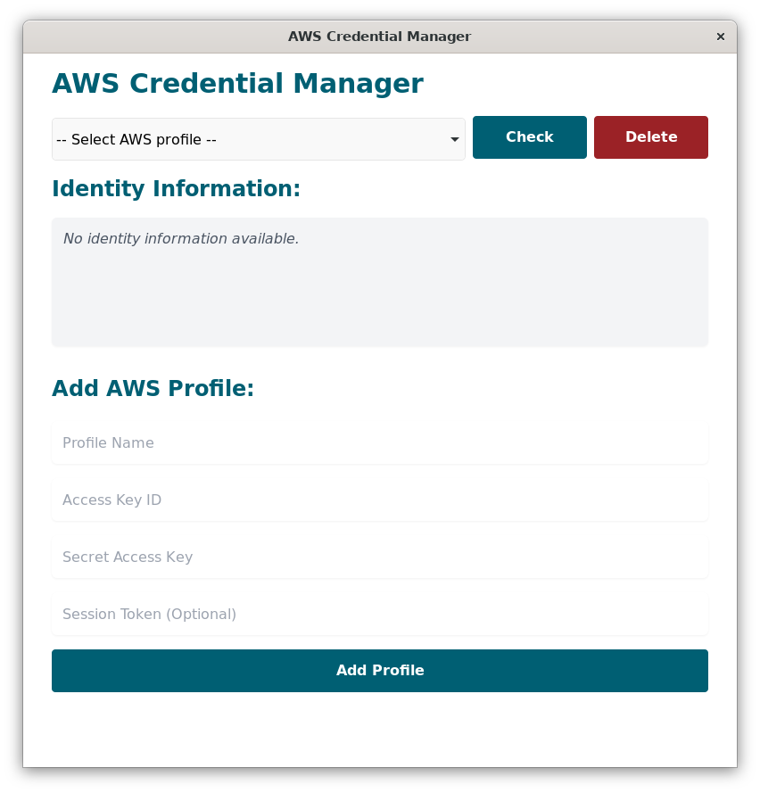

# aws-credential-manager

A demo Tauri + React + Typescript app!



## Recommended IDE Setup

- Ideally, run this in a devcontainer.
- [VS Code](https://code.visualstudio.com/) + [Tauri](https://marketplace.visualstudio.com/items?itemName=tauri-apps.tauri-vscode) + [rust-analyzer](https://marketplace.visualstudio.com/items?itemName=rust-lang.rust-analyzer)

## Generate Icons

```bash
# Install dependencies
pip3 install pillow==10.2.0 icnsutil==1.1.0

# Ensure you have a high resolution icon.png
./iconize.py --icon src-tauri/icons/icon.png --output src-tauri/icons
```

## Generate Signing Key

```bash
npm run tauri signer generate -- -w aws-credential-manager.key
```

Add the contents of `~/.tauri/aws-credential-manager.key.pub` to your `tauri.conf.json`:

```json
...
  "updater": {
    "active": true,
    "endpoints": [
      "https://github.com/t04glovern/aws-credential-manager/releases/latest/download/latest.json"
    ],
    "dialog": true,
    "pubkey": "<YOUR_PUBLIC_KEY>"
  },
...
```

> **IMPORTANT**: Add the contents of `aws-credential-manager.key` a ENV variable in GitHub Secrets called `TAURI_PRIVATE_KEY`.

## Tests

```bash
cargo install cargo-tarpaulin
cargo test -- --test-threads=1
cargo tarpaulin --out Lcov
```

## Development

> **NOTE**: It is highly recommend, and more or less required for you to run `wslg` X Server on Windows: [https://github.com/microsoft/wslg](https://github.com/microsoft/wslg). This repository is setup to use `export DISPLAY=:0` so that you can view the app when working in a devcontainer.

Press `F5` to start the app in development mode.

Alternatively, run the following commands:

```bash
npm run tauri dev
```

If you want to develop the React app separately, run the following commands:

```bash
npm run dev
# open http://localhost:1420/
```

## Build

```bash
# Load in TAURI_PRIVATE_KEY for signing
source env.sh

# Build the app
npm run tauri build
```
